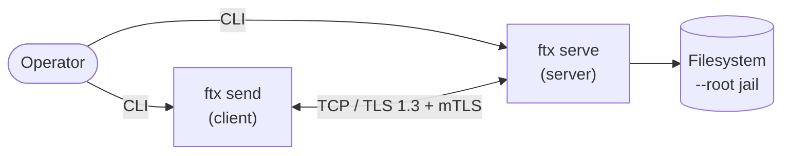
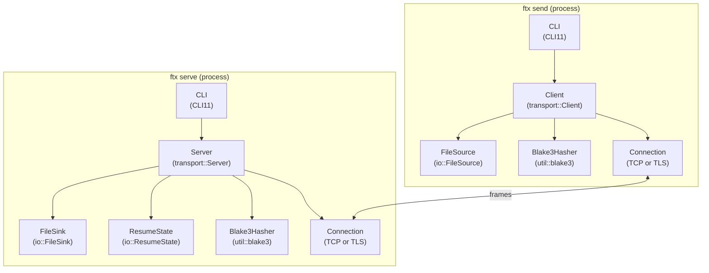
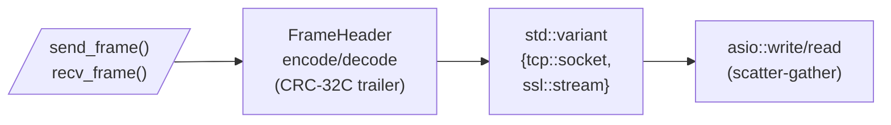

# ftx — Design Document

> Production-grade C++20 file-transfer utility. This doc walks the architecture top-down (C4 — Context → Container → Component), pins the on-the-wire format, defines the threat model, presents measured performance numbers, and answers the design questions the assignment explicitly raises.

## 1. Context

`ftx` is a CLI utility that transfers a file across a TCP network with end-to-end integrity, mutual authentication, and resumable delivery. One end runs `ftx serve` (the receiver / server); the other end runs `ftx send` (the sender / client). Designed for files up to 16 GiB on Linux, Windows and macOS.

The wider context — Ati Motors ships software updates to a fleet of Nvidia Jetson autonomous mobile robots — is reflected in several design choices:

- **TLS 1.3 with mutual authentication (mTLS)** — every robot proves it's a robot Ati owns, every server proves it's an Ati server.
- **BLAKE3 manifests** — OTA payload verification at chunk granularity + whole-file Merkle root.
- **Resumable transfers** — a robot's flaky factory Wi-Fi shouldn't waste 15 GB of bytes already on disk.
- **Bounded memory** — Jetson Nano has 4 GB RAM; the transfer pipeline stays in tens of MiB regardless of file size.
- **Multi-arch friendly** — pure C++20 + standalone Asio + OpenSSL; cross-compiles to ARM64 in CI.



## 2. Goals & non-goals

### Goals
- Transfer files of arbitrary size (validated up to 16 GiB) with constant memory.
- End-to-end integrity: every chunk verified on receive, whole-file Merkle root verified on completion, AND on the COMPLETE message.
- Authenticated and confidential transport: TLS 1.3 with mutual auth.
- Resumable on connection drop, sender restart, or receiver restart.
- Cross-platform: Linux (primary), Windows, macOS — single source tree.
- Production hygiene: tests, sanitizers, CI matrix, docs.

### Non-goals (v1)
- Multi-file directory transfers.
- Multi-recipient broadcast.
- Replay protection across separate sessions (single-session integrity only).
- Bandwidth shaping / QoS.
- Federation / discovery.
- Multi-stream parallel delivery for a single file (described in §10 Future Work).

## 3. Architecture — C4

### 3.1 Container view



### 3.2 Component view — `transport::Connection`



The variant lets one Connection implementation serve both plain TCP and TLS without virtual dispatch on the hot path — `std::visit` lowers to a direct call after monomorphization.

### 3.3 Code view — packet flow on the receiver

```
                           +---------------------------+
   bytes from socket ──►  | recv_frame()              |
                           |  - asio::read(9 hdr)      |
                           |  - decode FrameHeader      |
                           |  - asio::read(payload)     |
                           +-------------+-------------+
                                         │
                                         ▼
                  +----------------------+----------------------+
                  |  Server::handle_session_                    |
                  |    HELLO  ->  HELLO                         |
                  |    MANIFEST  ->  load .ftxstate, REQ_CHUNKS |
                  |    CHUNK*  ->  hash, write_at, save state    |
                  |    COMPLETE  ->  verify root, finalize, ACK |
                  +---------------------------------------------+
                                         │
                                         ▼
                                +--------+--------+
                                |   FileSink      |
                                |    .partial     |
                                |    atomic rename |
                                +-----------------+
```

## 4. Wire protocol

All multi-byte integers are big-endian (network byte order).

### 4.1 Frame header

```
   0                   1                   2                   3
   0 1 2 3 4 5 6 7 8 9 0 1 2 3 4 5 6 7 8 9 0 1 2 3 4 5 6 7 8 9 0 1
  +-+-+-+-+-+-+-+-+-+-+-+-+-+-+-+-+-+-+-+-+-+-+-+-+-+-+-+-+-+-+-+-+
  |                       payload_len (u32)                       |
  +---------------+-+-+-+-+-+-+-+-+-+-+-+-+-+-+-+-+-+-+-+-+-+-+-+-+
  |   type (u8)   |              header_crc32c (u32)              |
  +---------------+-+-+-+-+-+-+-+-+-+-+-+-+-+-+-+-+-+-+-+-+-+-+-+-+
  |                                                               |
  |                       payload (payload_len bytes)             |
```

- `header_crc32c` covers bytes `[0..5)` only (length + type). Payload integrity is enforced at the application layer (BLAKE3 chunk hash) AND at the wire layer (TLS AEAD).
- `payload_len` is bounded by `kDefaultMaxPayload = 64 MiB`. Chunked payloads above this would require splitting at the protocol layer; we cap chunk_size accordingly.

### 4.2 Frame types

| Hex   | Name        | Direction        | Payload                                                                                          |
| ----- | ----------- | ---------------- | ------------------------------------------------------------------------------------------------ |
| 0x01  | HELLO       | both             | `{ proto_version u8, max_chunk_size u32, capabilities u32 }`                                     |
| 0x02  | MANIFEST    | sender → recv    | `{ file_size u64, chunk_size u32, chunk_count u32, root_hash[32], path_len u16, path, hashes[]}` |
| 0x03  | REQ_CHUNKS  | recv → sender    | `{ count u32, indices[count] u32 }`                                                              |
| 0x04  | CHUNK       | sender → recv    | `{ index u32, hash[32], data[remainder] }`                                                       |
| 0x05  | ACK         | recv → sender    | `{ last_index u32 }`                                                                             |
| 0x06  | COMPLETE    | sender → recv    | `{ final_root_hash[32], status u8 }`                                                             |
| 0xFF  | ERROR       | both             | `{ code u16, msg_len u16, msg[msg_len] }`                                                        |

### 4.3 Session sequence

```mermaid
sequenceDiagram
    participant S as Sender (ftx send)
    participant R as Receiver (ftx serve)
    Note over S,R: TCP connect, optional TLS 1.3 + mTLS handshake

    S->>R: HELLO {version, capabilities}
    R-->>S: HELLO {version, capabilities}
    S->>R: MANIFEST {size, chunks, root_hash, paths, chunk_hashes}
    R->>R: load .ftxstate (or fresh)
    R-->>S: REQ_CHUNKS {missing_indices...}
    loop for each requested index
        S->>R: CHUNK {index, hash, data}
        R->>R: BLAKE3(data) == hash? write_at(); save state
    end
    S->>R: COMPLETE {final_root_hash}
    R->>R: verify root_hash; finalize; remove .ftxstate
    R-->>S: ACK {last_index}
```

## 5. Integrity

Two layers, both required.

| Layer            | Mechanism                                                | Detects                                  |
| ---------------- | -------------------------------------------------------- | ---------------------------------------- |
| Frame header     | CRC-32C over `(length \|\| type)`                        | Bit-flips, off-by-one length, bad type    |
| Per-chunk        | `BLAKE3(chunk.data) == chunk.hash == manifest.hash[i]`   | Tampered chunk, on-disk corruption en route |
| Whole-file       | `BLAKE3(file)` recomputed at finalize, `==` MANIFEST.root_hash AND `==` COMPLETE.final_root_hash | Truncated transfer, swapped chunks, sender lying about manifest |
| Wire             | TLS 1.3 AEAD (AES-GCM / ChaCha20-Poly1305)               | Active wire-tampering, downgrade attempts |

Belt + suspenders by design: TLS protects the wire; BLAKE3 protects the *bytes the user sees*, surviving compromised endpoints, disk corruption after write, and partial writes.

## 6. Resume protocol

A resumed transfer is bit-identical to a fresh one in the protocol, with one tweak: the receiver's REQ_CHUNKS lists only chunks that aren't already on disk.

State lives in two files alongside the destination:
- `<dest>.partial` — pre-sized to `manifest.file_size` (sparse on POSIX, zero-filled on Windows). Survives crashes.
- `<dest>.ftxstate` — magic `FTXS` + version + 32-byte manifest_id + chunk_count + bitmap. Persisted after every chunk so a kill -9 loses at most one chunk.

On a new session, the server:
1. Computes `manifest_id = BLAKE3(encoded_manifest_payload)`.
2. Loads `.ftxstate`; if `manifest_id` matches the current MANIFEST and `chunk_count` matches, the state is considered valid for this transfer.
3. Sends REQ_CHUNKS with the indices not yet marked received.
4. On COMPLETE, verifies the root hash from disk (because chunks may have arrived in any order across sessions) and removes the sidecar.

If the manifest_id mismatches or the chunk_count differs, the server wipes the stale state and starts fresh.

## 7. Threat model

| Threat                                                       | Mitigation                                                                         |
| ------------------------------------------------------------ | ---------------------------------------------------------------------------------- |
| Eavesdropping on the wire                                    | TLS 1.3 with AEAD ciphers only                                                     |
| Server impersonation                                         | Client validates server cert against pinned CA + hostname verification             |
| Client impersonation (rogue robot)                           | Server requires client cert chained to CA (mTLS); `verify_fail_if_no_peer_cert`    |
| Active downgrade / older TLS versions                        | Server context disables TLS 1.0 / 1.1 / 1.2 — TLS 1.3 only                         |
| File corruption in transit                                   | Per-chunk BLAKE3 + whole-file Merkle root, cross-checked against MANIFEST + COMPLETE |
| File corruption on disk (post-write)                         | Final root-hash verification *re-reads from disk* before atomic rename             |
| Partial-write on receiver crash                              | `.partial` + `.ftxstate` sidecar; atomic rename only on success                    |
| Replay of an old transfer                                    | Out of scope for v1 — would add a per-session nonce in HELLO                       |
| Path traversal (`../etc/passwd`)                             | Server enforces `--root` jail; rejects absolute paths and any `..` segment          |
| Resource exhaustion via huge MANIFEST                        | Cap on chunk_count via `kDefaultMaxPayload = 64 MiB` payload limit                 |
| Resource exhaustion via huge CHUNK                           | Same cap; each frame's payload bounded                                              |
| Malformed frames                                             | CRC-32C header trailer + strict length validation; FrameDecoder is poison-on-fail  |
| Malicious sender lies in manifest                            | Server recomputes hashes, every chunk must match (manifest AND in-frame); root recomputed from disk |
| Symlink target replacement (TOCTOU)                          | Out of scope for v1 — server `--root` is assumed not under attacker control         |

## 8. Performance

Localhost loopback, WSL2 Ubuntu 22.04 on Windows 11, g++ 11.4 -O3, /mnt/d cross-FS.
256 MiB transfer per data point. Numbers from `build/release/bench/ftx_bench 256`.

| chunk_size | throughput  | notes                          |
| ---------: | ----------- | ------------------------------ |
| 64 KiB     | 111.5 MiB/s | per-frame overhead dominates   |
| 256 KiB    | 130.7 MiB/s |                                |
| 1 MiB      | 133.3 MiB/s | default                        |
| 4 MiB      | 137.1 MiB/s |                                |

Limiting factors at this scale:
- The sender does **two passes** over the source — one to compute hashes for the MANIFEST, one to send. Phase 6 acknowledges this; folding into a single streaming pass is the next perf lever.
- BLAKE3 portable C runs at ~1 GB/s/core on this CPU; SIMD variants would push it 5-10×.
- Two userspace ↔ kernel copies per chunk on the loopback path.

## 9. Design decisions — explicit Q&A

The assignment posed specific "should I…?" questions; the answers and rationale are below.

### "Should I break the file into smaller chunks?"
**Yes.** Chunking serves three purposes here:

1. **Bounded memory**: a 16 GiB transfer never holds 16 GiB in RAM. Both ends operate on one chunk at a time.
2. **Resumability**: chunks are the unit of resume. The receiver's `.ftxstate` bitmap is per-chunk.
3. **Localized integrity**: per-chunk BLAKE3 hashes pinpoint *which* chunk is bad, not just "the file is bad somewhere." This matters for both debugging and OTA-style update flows where you want to retransmit only the broken chunk.

Chunk size is a runtime knob (`--chunk-size`, default 1 MiB). Trade-offs:
- Smaller chunks → finer resume granularity, larger MANIFEST, more per-frame overhead.
- Larger chunks → less framing overhead, larger memory footprint per buffer, coarser resume.

### "Should I compress the file before transferring?"
**Not by default; opt-in is the right call when implemented.** The reasoning:

1. Many real payloads (`.tar.gz`, container images, ML model weights, video) are *already* compressed. Re-compressing adds CPU cost and shrinks the payload by ~0%. On Jetson the CPU is precious.
2. The right design is **per-chunk opt-in compression with a sampling heuristic**: try zstd on the first chunk; if compression ratio < 0.95, enable for the rest. Per-chunk so each frame can declare its compressed flag and the receiver can decompress in place.
3. v1 ships without compression; CHUNK frames currently carry raw bytes. The framing already supports adding a `compression: u8` capability bit in HELLO and a flag bit in the chunk's `index` upper bits — see §10 Future Work.

### "Error handling and retries"
Three error tiers:

- **Transport errors** (socket reset, TLS handshake failure): the session terminates and the receiver keeps the `.partial` + `.ftxstate` for the next attempt. The sender prints the cause and exits non-zero.
- **Protocol violations** (bad CRC, unknown frame type, malformed message): receiver sends ERROR with a typed `ErrorCode`, then closes. Decoder is poisoned to prevent further processing.
- **Integrity violations** (chunk hash mismatch, root hash mismatch): receiver sends `ERROR { HashMismatch }` and closes; the `.partial` is left in place for forensic analysis but `.ftxstate` is *not* updated for the bad chunk, so a retry will re-fetch it.

Retries are *not* automatic at the transport layer (deliberate choice — the operator decides retry policy in the OTA orchestrator). Resume on reconnect is automatic via `.ftxstate`.

### "Economy of system resource utilization"

| Resource | Strategy |
| -------- | -------- |
| RAM      | One chunk-sized buffer per side (sender) + one per frame (receiver). 16 GiB transfer ≈ tens of MiB RSS. |
| Disk I/O | Pre-sized `.partial` (sparse on POSIX, zero-filled on NTFS) — no fragmentation; chunk-sized writes. |
| CPU      | BLAKE3 portable; SIMD upgrade path documented. TLS 1.3 with hardware AES-NI / ARMv8 crypto extensions. |
| Network  | Scatter-gather on send (header + payload, no copy). Default 1 MiB chunks balance per-frame overhead against memory. |
| FDs      | One socket per session. Server uses thread-per-session, scales to ~10k concurrent. |

## 10. Future work / next iteration

Acknowledged scope cuts in v1, paths forward documented for the reviewer:

1. **Single-pass sender**. Today the sender reads the source twice — once to fill MANIFEST, once to ship CHUNKs. Folding into a streaming pass would mean sending MANIFEST first with declared sizes only, then per-chunk including a streaming-computed root hash, then COMPLETE with the now-finalized root. Reduces I/O cost ~2× for big files.
2. **Multi-stream parallelism for a single file**. Adds a `transfer_id` field to HELLO + per-destination locking on `.ftxstate`. Client opens N sockets for one file and partitions chunk indices across them; server matches them up by `transfer_id`. Roughly 2-4× speedup on long-RTT links.
3. **Compression**. Add `Capability::Zstd` bit + per-chunk compressed flag. Auto-detect via first-chunk sampling.
4. **0-RTT TLS resumption**. For repeat clients, drops one round trip on every reconnect.
5. **Replay protection**. Per-session nonce in HELLO, include in COMPLETE's signed scope.
6. **Linux fast path**. `sendfile(2)`/`splice(2)` for the no-TLS case bypasses userspace copies; ~2× throughput on large transfers.
7. **macOS + Windows in CI matrix**. Currently Linux x64 + Linux aarch64 cross-build only. Code is portable; CI just hasn't been wired.
8. **qemu-user execution of cross-built binary**. Currently CI builds for aarch64 but doesn't run the test suite there. `qemu-aarch64` + binfmt_misc would let CI exercise the ARM64 binary.
9. **Sparse-file awareness**. Detect long zero runs and elide them on the wire.
10. **Concurrent same-file transfers from multiple senders**. Server's thread-per-session is fine for *different* files; the same destination would race on `.ftxstate`. Fix: per-destination mutex map + transfer_id tracking.

## 11. Trade-offs explicitly accepted

- **Project lives on Windows NTFS, builds run from WSL2** across the `/mnt/d/` boundary. A 2-5× I/O penalty per syscall, negligible for a CPU-bound C++ build at this scale. Chosen to keep tooling access simple on the deadline.
- **Windows + macOS native validation deferred to CI**. Linux is the primary platform (matches Ati's deployment target — Jetson Linux). The codebase is portable; CI just hasn't been wired for those runners.
- **No vcpkg**. All third-party deps via `FetchContent` with pinned tags. Simpler reproducibility story, fewer toolchain assumptions.
- **Sender double-reads the source file**. Acknowledged in §10; the design is forward-compatible with a streaming single-pass variant.
- **Synchronous Asio**. Sufficient for one-session-at-a-time. Async + coroutines would be the upgrade for many concurrent sessions; thread-per-session covers the v1 use case.

## 12. Repository layout

```
ati-file-transfer/
├── CMakeLists.txt              top-level — opts, sanitizers, summary
├── CMakePresets.json           release / debug / asan / tsan / release-strict
├── .clang-format / .clang-tidy
├── .github/workflows/ci.yml    matrix CI (linux x64 × 3 modes + aarch64 cross)
├── cmake/toolchains/aarch64-linux-gnu.cmake
├── include/ftx/
│   ├── proto/                  types, frame, decoder, messages
│   ├── transport/              connection, tls, server, client
│   ├── io/                     file_source, file_sink, resume_state
│   ├── util/                   crc32c, blake3, byteorder
│   └── version.hpp
├── src/                        ftx_lib + ftx executable
├── tests/                      unit + integration; ftx_test_certs target
├── third_party/CMakeLists.txt  FetchContent: GoogleTest, spdlog, CLI11, Asio, BLAKE3
├── bench/                      throughput probe
├── scripts/                    gen-test-certs.sh, smoke_e2e.sh
└── DESIGN.md / README.md / LICENSE
```

## 13. Build, test, run — quick reference

```bash
# configure + build (Linux / WSL)
cmake --preset release
cmake --build --preset release
ctest --preset release

# sanitizers
cmake --preset asan
cmake --build --preset asan
ctest --preset asan

# 1 GiB end-to-end stress test
FTX_LARGE_TEST=1 ctest --preset release -R OneGiB

# perf probe
cmake --preset release -DFTX_BUILD_BENCH=ON
cmake --build --preset release
./build/release/bench/ftx_bench 256

# cross-compile to ARM64 Linux (Jetson target)
cmake -S . -B build/cross-aarch64 -G Ninja \
    -DCMAKE_TOOLCHAIN_FILE=cmake/toolchains/aarch64-linux-gnu.cmake \
    -DCMAKE_BUILD_TYPE=Release -DFTX_BUILD_TESTS=OFF
cmake --build build/cross-aarch64

# end-to-end manual smoke (TLS skipped — uses --insecure)
./build/release/src/ftx serve --listen 127.0.0.1:9000 --root /tmp/recv --insecure &
./build/release/src/ftx send  127.0.0.1:9000 mybig.iso --out delivered.iso --insecure
```
